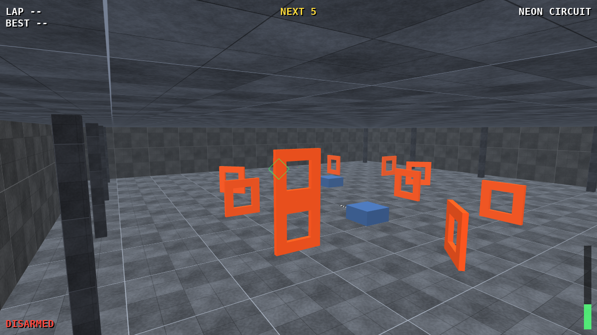
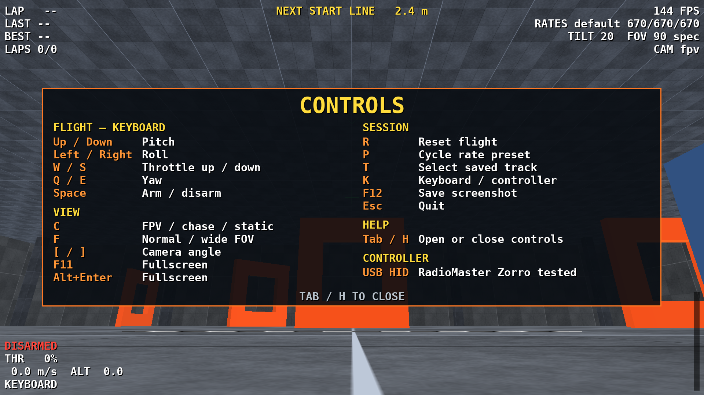
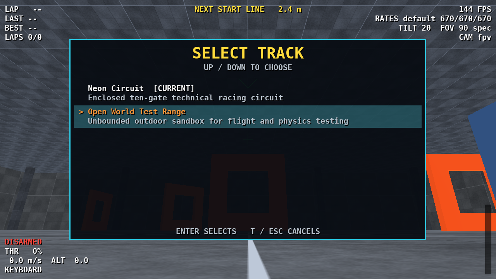

# Open Drone Racing Sim

A lightweight, configurable FPV racing simulator built in Python. It combines a
fixed-step quadrotor model, Betaflight-style rate curves, solid collision geometry,
lap scoring, transmitter input, and an OpenGL renderer in a self-contained desktop
application.



The simulator is designed for practice and experimentation rather than
photorealism. Its flight model and scoring rules are readable, every run can be
logged reproducibly, and custom tracks are ordinary YAML files.

## Features

- 1 kHz fixed-step rigid-body physics and rate controller, accelerated with Numba
- Betaflight and Actual rate curves, deadband, throttle expo, Quad-X mixing, motor
  lag, airmode saturation, and aerodynamic drag
- Solid floors, finite venue walls and roofs, and gate-frame collisions
- Swept gate-plane intersection and ordered lap scoring
- FPV, chase, and static cameras rendered with ModernGL
- Saved-track discovery and an in-game track selector
- USB RC-transmitter/game-controller calibration and keyboard controls
- Per-tick flight logs, lap summaries, configuration snapshots, and replays
- Automated physics, geometry, input, logging, display, and platform-boundary tests

## Platform status

| Platform | Status |
| --- | --- |
| Linux | Verified with keyboard and a RadioMaster Zorro over USB HID |
| Windows 10/11 | Verified with keyboard on a native Windows desktop; controller test pending |
| macOS | Not currently tested |

The Windows desktop application, OpenGL renderer, and keyboard controls have been
smoke-tested successfully. USB controller and transmitter handling on Windows still
needs hardware verification. Please report the GPU, driver, Python version,
controller model, and terminal output if you encounter a problem.

## Requirements

- 64-bit Python 3.12
- An OpenGL 3.3-capable GPU and current graphics driver
- A USB game controller or RC transmitter in joystick/HID mode (optional)

Keyboard flight is useful for validating an installation. A transmitter is strongly
recommended for meaningful practice.

## Quick start

Clone the source first:

```text
git clone https://github.com/benjfinc/open-drone-practice-sim.git
cd open-drone-practice-sim
```

Linux:

```bash
python3.12 bootstrap.py
python3 run.py
```

Windows PowerShell:

```powershell
py -3.12 bootstrap.py
py run.py
```

`bootstrap.py` creates a project-local `.venv`, installs the pinned dependencies in
editable mode, and runs the tests. It does not modify system Python. The convenience
wrappers `./setup.sh` and `./run.sh` are available on Linux; `./setup.ps1` and
`./run.ps1` are available in PowerShell. The Python commands above also work when
PowerShell script execution is restricted.

The first launch compiles the physics kernels and can take several seconds. Plain
`run.py` opens the saved-track selector; use the arrow keys and `Enter` to choose a
course.

Useful options are the same on both platforms:

```text
python run.py --keyboard
python run.py --list-tracks
python run.py --track open-world
python run.py --set camera.fov_mode=wide
python run.py --set rates.default_preset=pro --set display.fullscreen=true
python run.py --no-log
```

Every configuration value can be overridden with `--set section.key=value`. Merge an
additional YAML file with `--overlay path/to/settings.yaml`.

On a hybrid-GPU Linux laptop, request NVIDIA PRIME offload with:

```bash
DRONE_SIM_PRIME_OFFLOAD=1 ./run.sh
```

## Transmitter setup

The simulator reads SDL joystick/HID devices and is not tied to one radio brand. A
**RadioMaster Zorro is confirmed working on Linux** when connected by USB in **USB
Joystick (HID)** mode. Other transmitters and gamepads should work after calibration;
Windows controller input still needs hardware verification.

Run the guided calibration after setup.

Linux:

```bash
.venv/bin/python calibrate.py
```

Windows PowerShell:

```powershell
.venv\Scripts\python.exe calibrate.py
```

Add `--show` to inspect raw axes and buttons. Calibration records axes, directions,
endpoints, arm switch, rate-preset switch, and an optional reset control in the
local-only `config/calibration.yaml`. Until calibration is complete, the simulator
uses an explicitly unverified default mapping. Arming is blocked unless throttle is
below 5%.

This is controller input only. The simulator does not connect to or configure a
physical drone's onboard flight controller.

## Controls



| Input | Action |
| --- | --- |
| Mode 2 sticks | Acro/rate-mode flight |
| Arm switch or `Space` | Arm or disarm |
| Preset switch or `P` | Cycle rate preset |
| Reset switch or `R` | Return to the start |
| `[` / `]` | Decrease/increase camera uptilt |
| `C` | Cycle FPV, chase, and static cameras |
| `F` | Toggle 90-degree and 115-degree horizontal FOV |
| `F11` or `Alt+Enter` | Toggle fullscreen |
| `Tab` or `H` | Show or hide the in-game instructions |
| `T` | Open the saved-track selector |
| `K` | Toggle keyboard flight mode |
| Arrow keys | Keyboard roll and pitch |
| `Q` / `E` | Keyboard yaw |
| `W` / `S` | Keyboard throttle |
| `F12` | Save a screenshot in the current run directory |
| `Esc` | Quit |

The responsive instruction panel appears on first launch. Press `Tab` or `H` to
close it. Attempting to raise throttle while disarmed displays the appropriate arm
instruction for keyboard or transmitter input.

## Tracks and collision geometry

The included original tracks are:

- **Neon Circuit** — ten scoring stations, a timing line, a stacked double gate,
  and a finite enclosed venue.
- **Open World Test Range** — six gates in an outdoor sandbox with no generated
  walls or roof.

Press `T` to switch saved tracks or launch one directly with `--track`. Track
geometry lives under `assets/`; preset metadata and venue settings live under
`config/tracks/`. New presets are discovered automatically.



Walls and roofs are finite collision boxes generated from each preset. The renderer
and physics use the same geometry, so an enclosed track does not impose an invisible
world-wide ceiling. See [Custom tracks](docs/CUSTOM_TRACKS.md) for the schema and an
example.

## Simulation and scoring

At each 1 ms tick, stick input passes through a selectable rate curve and RC smoothing
filter. A physical-units PID controller turns angular-rate error into angular
acceleration, the Quad-X mixer allocates torque and collective thrust, and first-order
motor models drive a six-degree-of-freedom rigid body.

Gate passage intersects the vehicle's swept segment with each gate plane and checks
the interpolated point against the aperture. Reverse crossings and frame contacts are
tracked separately, preventing near misses from being counted as completed gates.

The default vehicle is a useful practice baseline, not a validated model of a
specific aircraft. Values marked `PLACEHOLDER` in `config/default.yaml` should be
replaced when measured mass, inertia, propulsion, drag, and camera data are available.

## Run data and replay

Each logged session is written under `runs/<timestamp>/`:

| File | Contents |
| --- | --- |
| `ticks.npz` | Vehicle state, rates, inputs, motor commands, and event flags at 1 kHz |
| `frames.npz` | Render timestamps and camera/body poses |
| `events.jsonl` | Arming, resets, crashes, crossings, misses, and laps |
| `laps.json` / `laps.csv` | Completed and aborted lap summaries |
| `config_used.yaml` | Exact effective simulator configuration |
| `calibration_used.yaml` | Exact input calibration |
| `meta.json` | Source hashes, renderer, controller, and coordinate conventions |

Long sessions are checkpointed so an interruption loses at most the active chunk.
From the repository directory, inspect a run with the virtual-environment Python:

```text
python summary.py runs/<timestamp>
python replay_lap.py runs/<timestamp>
```

On Linux that interpreter is `.venv/bin/python`; on Windows it is
`.venv\Scripts\python.exe`. The `fpvsim.loader` module also exposes recorded data for
analysis and camera-trajectory export.

## Development

Activate `.venv`, then run:

```text
python -m pytest -q
python bench.py
```

The CI workflow runs the unit suite and command-line smoke test on both Ubuntu and
Windows. Graphical rendering and keyboard input have also been smoke-tested on a
native Windows desktop. Contribution expectations are in
[CONTRIBUTING.md](CONTRIBUTING.md).

Key modules:

```text
fly.py                 application loop and controls
fpvsim/dynamics.py     rate loop, mixer, motors, and rigid-body physics
fpvsim/sim.py          simulation state and collision handling
fpvsim/track_env.py    course loading, venue geometry, and scoring
fpvsim/render.py       OpenGL renderer and responsive on-screen display
fpvsim/gl_platform.py  platform-specific SDL and OpenGL context boundary
fpvsim/logger.py       reproducible session logging
fpvsim/loader.py       recorded-run analysis API
```

## Verification and limitations

The automated suite checks rate equations, mixer allocation, control directions,
hover stability, response to step and random inputs, aperture and reverse crossings,
finite wall/roof and frame collisions, lap ordering, log round trips, responsive
display layout, platform-specific OpenGL selection, and the module entry point.

These checks establish software behavior and runtime headroom; they do not establish
fidelity to a particular airframe. Human handling assessment, controller mapping,
display latency, and real-aircraft system identification depend on the user's hardware
and tuning. Linux has been exercised interactively, and Windows rendering and keyboard
input have completed a native desktop smoke test. Windows controller behavior remains
to be verified with hardware.

## Safety

This is a desktop practice and research simulator. Do not use its configuration or
results as flight-safety evidence or copy them directly to a physical aircraft without
independent validation.

## License and attribution

Yes, an open-source repository needs an explicit license so other people know what
they are permitted to use, modify, and redistribute. Open Drone Racing Sim is
copyright 2026 Benjamin Finch and distributed under the
[GNU General Public License v3.0 or later](LICENSE), without warranty.

GPL-3.0-or-later is the compatible choice because `fpvsim/rates.py` adapts rate-curve
equations from GPL-licensed Betaflight. A permissive license such as MIT should not be
substituted without first replacing or separately reviewing that adapted code. See
[THIRD_PARTY_NOTICES.md](THIRD_PARTY_NOTICES.md) for the upstream source and license.
